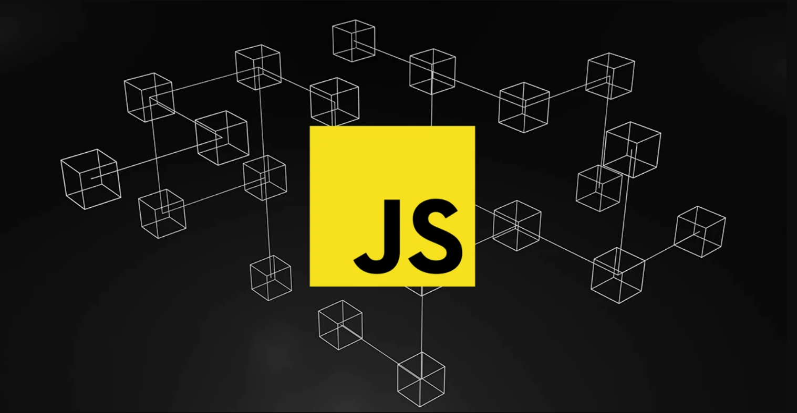

# Estudos de JavaScript e seu Ecossistema
 Bem-vindo ao repositório Estudos de JavaScript e seu Ecossistema! Aqui você encontrará uma compilação de estudos sobre JavaScript, abrangendo desde os conceitos básicos até técnicas mais avançadas, incluindo o uso de bibliotecas e frameworks como React, React Native, Next.js, Node.js e TypeScript.

## Conteúdo
O respositório está organizado em diferentes seções, cobrindo uma ampla gama de tópicos:

1. Introdução ao JavaScript
    * Sintaxe e estrutura
    * Variáveis e tipos de dados
    * Operadores
    * estruturas de controle (if, switch, loops)

2. Funções e Manipulação do DOM

    * Declaração de funções

    * Eventos no DOM

    * Manipulação de elementos HTML

3. Programação Assíncrona

    * Callbacks

    * Promises

    * Async/Await

4. Consumo de APIs

    * Fetch API

    * Axios (mesmo sendo uma biblioteca externa, incluiremos comparação com Fetch)

    * Manipulação de dados JSON

5. Conceitos Avançados

    * Closures

    * Prototype e Herança

    * ES Modules

    * Web Storage (LocalStorage e SessionStorage)

6. Bibliotecas e Frameworks

    * Introdução ao React

    * Componentes e Props no React

    * Estado e Efeitos no React

    * React Router e navegação

    * Introdução ao Next.js

    * Páginas e Rotas no Next.js

    * Introdução ao React Native

    * Criação de aplicativos móveis com React Native

    * Introdução ao Node.js

    * Criando APIs com Express

    * Trabalhando com Banco de Dados no Node.js

    * Introdução ao TypeScript

    * Tipagem e Interfaces no TypeScript

## Como Utilizar

1. Clone este repositório: 
https://github.com/CarlosMonnerat/javascript

2. Navegue pelos diretórios e explore os arquivos.

3. Experimente os exemplos no navegador ou em um ambiente Node.js.

## Contribuição

Fique à vontade para contribuir! Caso queira adicionar um novo tópico ou melhorar o material existente:

1. Faça um fork do repositório.

2. Crie uma nova branch: git checkout -b minha-contribuicao

3. Faça suas alterações e commit: git commit -m 'Melhoria no tópico X'

4. Envie um Pull Request!

## 🌟 Recursos Adicionais

    * MDN Web Docs - JavaScript

    * ECMAScript Specification

    * You Don't Know JS (livro)

## Autor

Criado por https://github.com/CarlosMonnerat. Entre em contato caso tenha dúvidas ou sugestões!

    🚧 Repositório ainda em construção... 🚧

